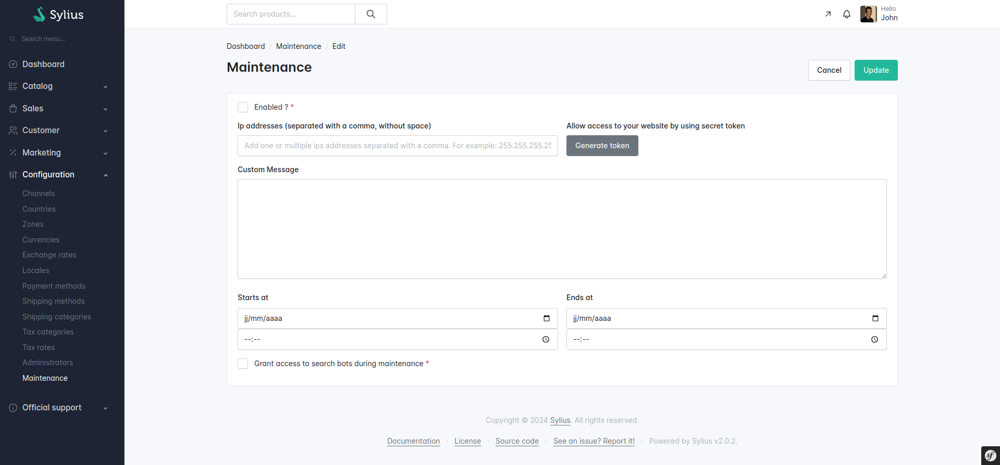

[](https://github.com/synolia/SyliusMaintenancePlugin/blob/master/LICENSE)
[](https://github.com/synolia/SyliusMaintenancePlugin/actions/workflows/analysis.yaml)
[](https://github.com/synolia/SyliusMaintenancePlugin/actions/workflows/sylius.yaml)
[](https://packagist.org/packages/synolia/sylius-maintenance-plugin)
[](https://packagist.org/packages/synolia/sylius-maintenance-plugin)

<p align="center">
    <a href="https://sylius.com" target="_blank">
        
    </a>
</p>

<h1 align="center">Sylius Maintenance Plugin</h1>

## Features

### When your website is under maintenance, and you want to :

* Do not allow access to your website and display the message "the website is under maintenance" on the frontpage.
* Allow access to your website to some Ips addresses or secret token
* Activate and deactivate these behaviors by commands
* Activate and deactivate behaviors in your Sylius Back-office
* Custom your message in your Sylius Back-office

## Requirements

|        | Version    |
|:-------|:-----------|
| PHP    | ^7.4, ^8.0 |
| Sylius | ^1.9       |

## Installation

1. Add the bundle and dependencies in your composer.json :

    ``` shell   
    composer require synolia/sylius-maintenance-plugin
    ```

2. Import required config in your `config/packages/_sylius.yaml` file:

    ``` yaml    
    imports:
        - { resource: "@SynoliaSyliusMaintenancePlugin/Resources/config/config.yaml" }
    ```

3. Import routing in your `config/routes.yaml` file:

    ``` yaml   
    synolia_maintenance:
        resource: "@SynoliaSyliusMaintenancePlugin/Resources/config/admin_routing.yaml"
        prefix: '/%sylius_admin.path_name%'
    ```

4. Clear cache

    ``` shell
    php bin/console cache:clear
    ```

## Usage

- To turn your website under maintenance, please create a file **maintenance.yaml** at the root of your project.
- If you want to allow access for some Ips, please add these Ip into **maintenance.yaml**   
   For example :   

    ``` yaml   
    ips: [172.16.254.1, 255.255.255.255, 192.0.0.255]
    ```

### You can turn your website under maintenance by console commands :

  1. Enable the plugin

     ``` shell
      php bin/console maintenance:enable
      ```
  2. Enable the plugin and add one or multiple ips addresses separated with a space

      ``` shell
      php bin/console maintenance:enable 172.16.254.1 255.255.255.255 192.0.0.255
      ```
  3. Disable the plugin

      ``` shell
      php bin/console maintenance:disable
      ```

### You can also turn your website under maintenance in Back Office :     

- Enable/disable the plugin
- Allow access for one or multiple ips addresses (optional)
- Allow access for secret token (optional)
- Create your custom message (optional)

### If you want to put the **maintenance.yaml** in a directory, please add your directory in .env:
For example :

``` yaml 
 SYNOLIA_MAINTENANCE_DIR=var/maintenance
   ```



## Development

See [How to contribute](CONTRIBUTING.md).

## License

This library is under the [EUPL-1.2 license](LICENSE).

## Credits

Developed by [Synolia](https://synolia.com/).
